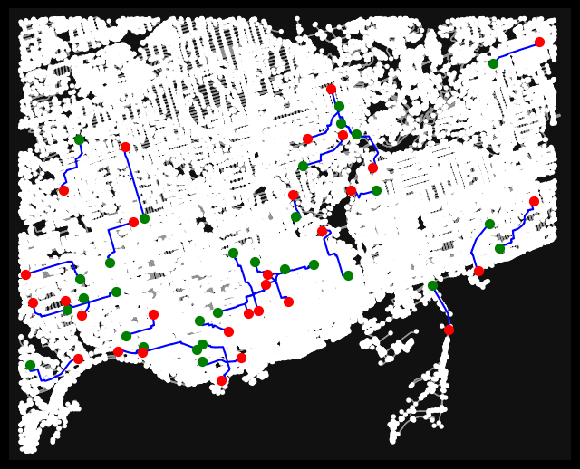
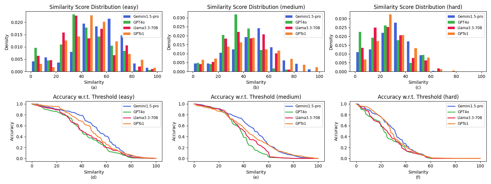

# TurnBack


[English](README.md) | 简体中文

本仓库是论文 **TurnBack: A Geospatial Route Cognition Benchmark for Large Language Models through Reverse Route** 的公开发布版本。

仓库只保留四类真正对外可用的内容：

1. `36kroutes/`：公开发布的原始路线语料
2. `path-builder execute`：公开版 Path Builder 执行器
3. `path-builder generate-routes`：`easy / medium / hard` 三档路线生成器
4. `path-builder generate-reverse`：面向外部大模型 API 的反转指令生成器

## 论文简介

TurnBack 把 **路径反转** 当作检验大模型地理空间认知能力的具体任务。模型首先拿到正向导航指令，目标是生成一条回到起点的反向路线指令。随后，我们用 Path Builder 把模型输出的反向指令重新执行成几何路线，再把恢复出的路线与参考反向路线做对比。

论文主要贡献有三部分：

- 提出了论文中定义的 `12` 个大都市、`36,000` 条步行路线的大规模路径反转 benchmark
- 提出了 Path Builder，把自然语言导航重新执行为街道级几何路径
- 提出了基于恢复几何而不是文本表面重叠的 route-level 评测方法



## 快速开始

安装：

```bash
python3.12 -m venv .venv
source .venv/bin/activate
pip install -e .[dev,llm]
```

生成三档新路线：

```bash
path-builder generate-routes \
  --city Toronto_Canada \
  --easy 20 \
  --medium 20 \
  --hard 20 \
  --output-root tmp/generated_routes \
  --ors-api-key "$ORS_API_KEY"
```

用你自己的大模型 API key 生成反转指令：

```bash
path-builder generate-reverse \
  --provider openai \
  --city "Toronto, Canada" \
  --input-file 36kroutes/Toronto_Canada/easy/0/natural_instructions.txt \
  --raw-output tmp/reverse_raw.txt \
  --clean-output tmp/reverse_clean.txt
```

用 Path Builder 执行反转指令：

```bash
path-builder execute \
  --root 36kroutes \
  --city Toronto_Canada \
  --difficulty easy \
  0 \
  --instructions tmp/reverse_clean.txt \
  --executor hybrid \
  --output tmp/recovered_route.geojson
```

将恢复路线与参考路线做相似度评分：

```bash
path-builder score \
  tmp/recovered_route.geojson \
  36kroutes/Toronto_Canada/easy/0/route.geojson \
  --config configs/similarity.paper.json
```

## 主要结果



- EMNLP 2025 论文提出了一个覆盖 `12` 个大都市、总计 `36,000` 条路线、包含三档难度的 benchmark。
- 论文中 Path Builder 在 Toronto、Tokyo、Munich 上的成功率分别为 `96%`、`90%`、`94%`。
- 在代表性的 easy 反转样例上，没有模型能精确回到起点；Gemini 的相似度达到 `73.4`，Llama 为 `22.6`。
- 在 Toronto 的 `200` 条 easy 路线上，给 GPT-4o 增加向量地图提示后，return rate 从 `6.4%` 提升到 `43.7%`，similarity 从 `41.06` 提升到 `73.08`。

## 为什么目录还叫 `36kroutes`？

`36kroutes` 是论文时期沿用下来的发布名称。当前仓库中的这个目录不是重新命名后的“精确 36k 子集”，而是后续保留下来的原始发布快照。

当前磁盘目录快照：

- 城市目录数：`13`
- 路线文件夹总数：`40,752`
- 含 `route.geojson` 的有效路线文件夹：`40,728`

论文中写的 `36,000` 条路线，对应的是论文使用的原始 benchmark 子集；当前公开目录为了保持连续性，沿用了 `36kroutes` 这个历史名称，而没有在后续增补后改名。

更具体地说，当前原始发布与论文中的 benchmark 城市集合并不完全一一对应：

- 论文 benchmark 写的是 `12` 个城市、`36,000` 条路线
- 当前原始发布目录里有 `13` 个城市目录
- 当前原始发布包含 `Paris_France` 和 `Rio_de_Janeiro_Brazil`
- 论文正文列出了 `São Paulo`，但当前原始发布目录里没有 `Sao_Paulo` 文件夹

当前城市列表见 [36kroutes/README.md](36kroutes/README.md)。

## 仓库结构

```text
.
├── 36kroutes/                # 已发布原始路线语料
├── assets/                   # 复用自论文的图
├── configs/similarity.paper.json
├── src/path_builder/         # Path Builder、路线生成、prompting、评分
├── scripts/quick_check.sh    # 本地 smoke test
├── tests/                    # 公开测试集
├── README.md                 # 英文 README
├── README.zh-CN.md           # 中文 README
├── CITATION.cff
└── pyproject.toml
```

## 快速检查

```bash
ruff check src/path_builder tests --select F,E9
python -m compileall src/path_builder
pytest -q
./scripts/quick_check.sh
```

## 引用

如果你使用了本仓库的代码或数据，请引用 TurnBack 论文。引用元信息见 [CITATION.cff](CITATION.cff)。
