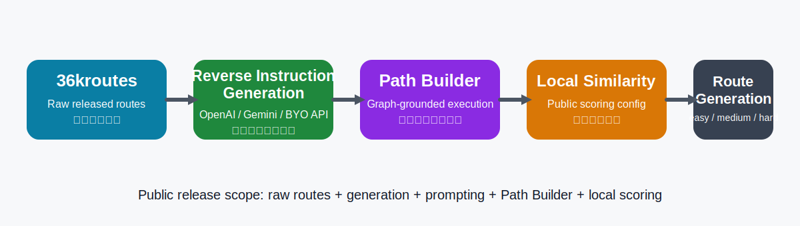

# TurnBack

## English

TurnBack is a public release package for route reversal research. This site documents the repository as a **clean GitHub-ready code release** centered on:

- `36kroutes/`
- route generation
- reverse-instruction API adapters
- Path Builder
- local similarity scoring

Start here:

- [English overview](en/overview.md)
- [English quick start](en/quickstart.md)
- [English repository guide](en/repository.md)
- [English data note](en/data.md)
- [English module map](en/modules.md)
- [English release policy](en/release.md)
- [English FAQ](en/faq.md)

## 中文

TurnBack 是一个面向路线反转研究的公开发布包。这个站点把仓库整理成了一个 **可以直接用于 GitHub 的干净代码发布版本**，核心围绕：

- `36kroutes/`
- 三档路线生成
- 反转指令 API 适配
- Path Builder
- 本地相似度评分

从这里开始：

- [中文总览](zh/overview.md)
- [中文快速开始](zh/quickstart.md)
- [中文仓库导览](zh/repository.md)
- [中文数据说明](zh/data.md)
- [中文模块导览](zh/modules.md)
- [中文发布政策](zh/release.md)
- [中文 FAQ](zh/faq.md)

## Release Principles

- keep the public surface small
- make the route workflow obvious
- avoid hidden dependencies
- separate documentation from experimentation noise

## 发布原则

- 公开面尽量小
- 让路线工作流一眼能懂
- 避免隐藏依赖
- 把文档与实验噪音分开
